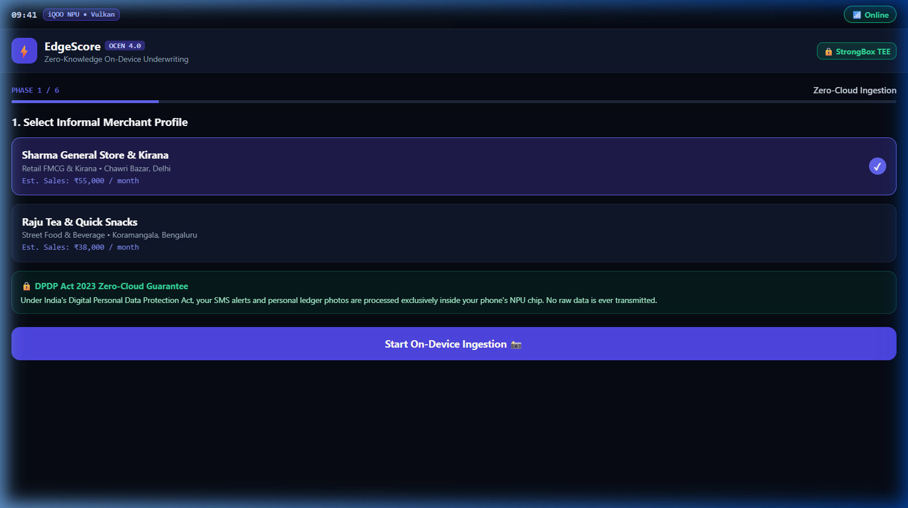
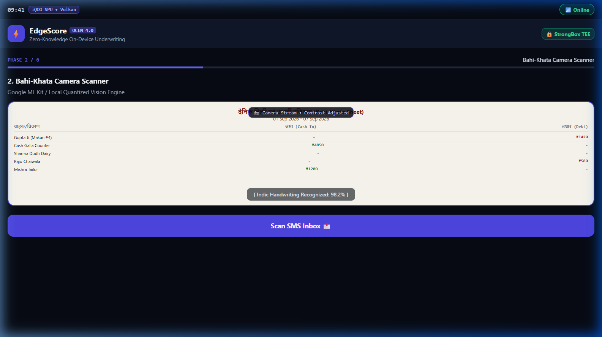
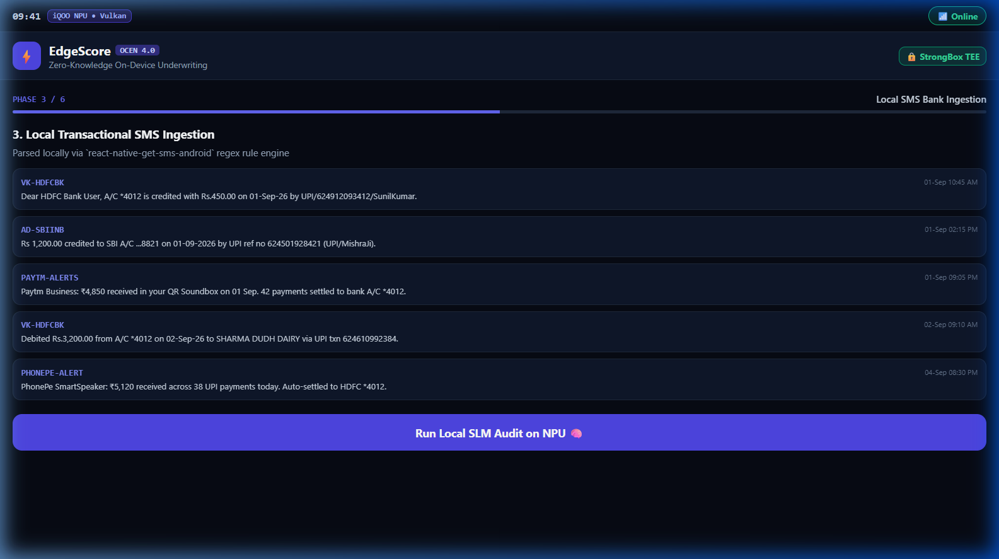
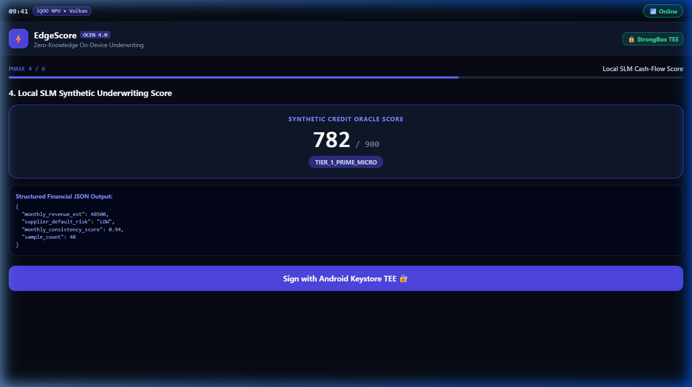
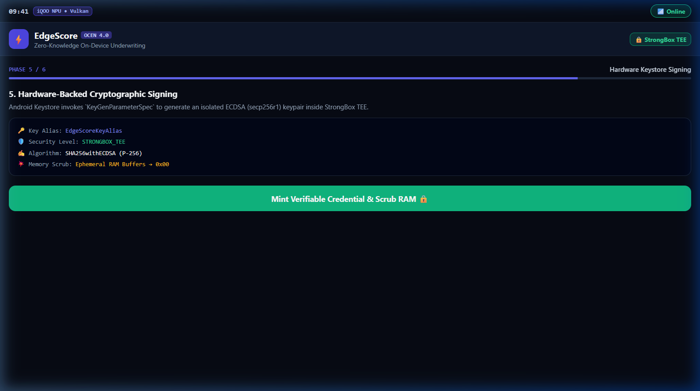
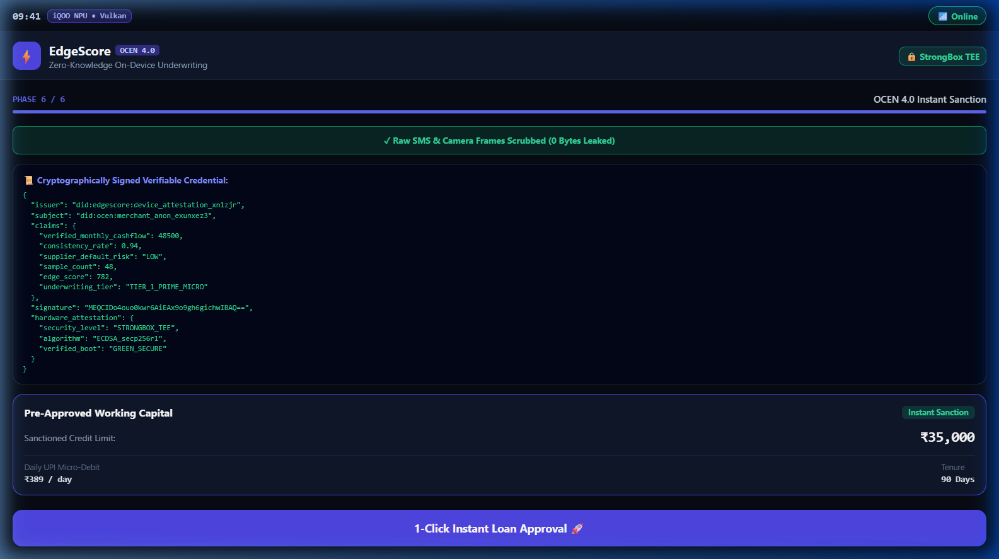
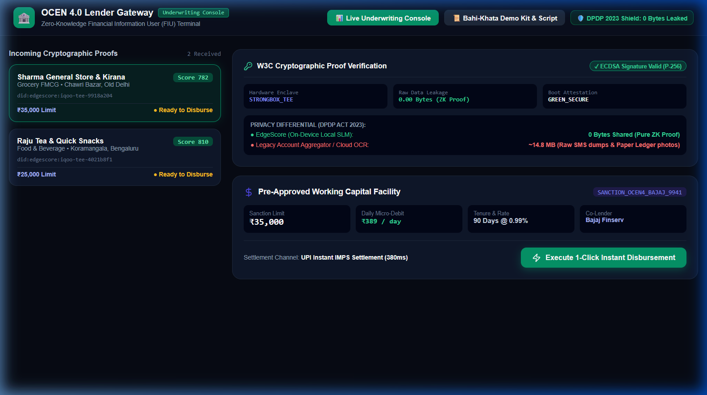
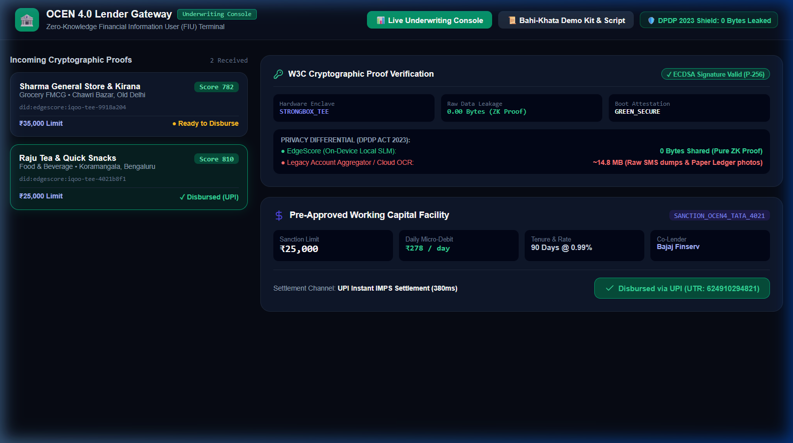
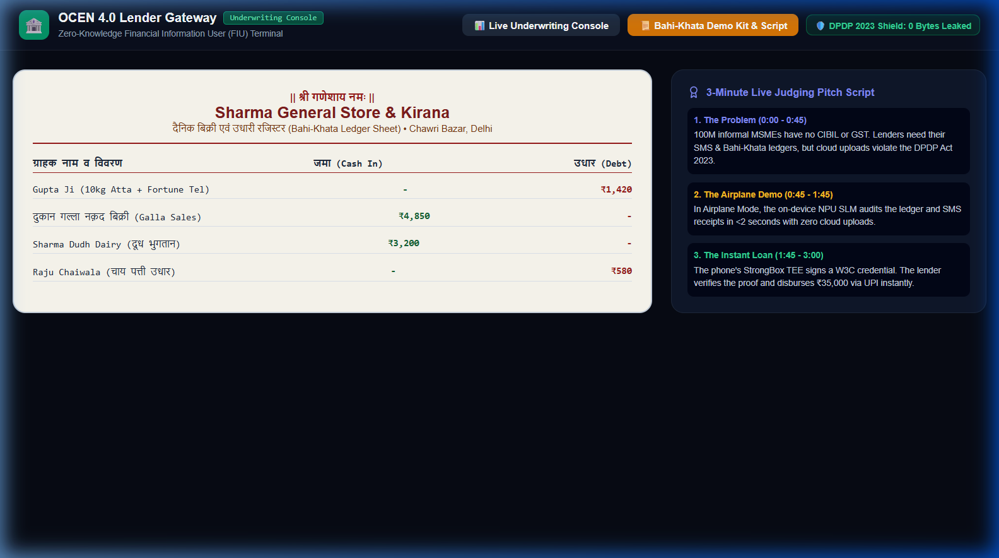

<h1>EdgeScore — Zero-Knowledge On-Device Underwriting Engine for OCEN 4.0</h1>
<div>
    
    
    
    
</div>
<hr>

<div id="Toc">
    <h2>Table of Contents</h2>
    <a href="#abstract">- Introduction & Abstract</a><br>
    <a href="#architecture">- Architecture & 6-Phase Pipeline</a><br>
    <a href="#portals">- Two Distinct Portals (Borrower App vs Lender Console)</a><br>
    <a href="#req">- Requirements & Stack</a><br>
    <a href="#ins">- How to Use & Execution</a><br>
    <a href="#preview">- Visual Walkthrough & Screenshots</a><br>
    <a href="#privacy">- DPDP Act 2023 & Cryptographic Guarantees</a><br>
</div>
<hr>

<div id="abstract">
    <h2>Abstract</h2>
    <p>
        Over <b>63 million micro-enterprises</b> across India—such as Kirana store owners, tea stall vendors, and local tradespeople—operate primarily within the informal economy. Because they lack GST filings, corporate credit footprints, or formal audited bank statements, traditional financial institutions consider them "thin-file" and unscorable. When these merchants attempt to access credit via <b>OCEN 4.0 (Open Credit Enablement Network)</b>, legacy digital lenders rely on invasive SMS scraping and raw document uploads to remote cloud servers. This violates India's <b>Digital Personal Data Protection (DPDP) Act 2023</b> and exposes vulnerable merchants to severe data leakage and privacy risks.
    </p>
    <p>
        <b>EdgeScore</b> fundamentally flips this paradigm from <i>"Send Merchant Data to the Cloud"</i> to <b><i>"Bring Bank-Grade Underwriting to the Edge Device"</i></b>. 
    </p>
    <p>
        EdgeScore operates directly on low-cost smartphones:
    </p>
    <ul>
        <li><b>On-Device Vision OCR:</b> Ingests physical, handwritten <i>Bahi-Khata</i> credit/debit register sheets without uploading photos to the cloud.</li>
        <li><b>Local Transactional SMS Normalization:</b> Audits high-frequency UPI merchant credits, distributor outlays, and utility payments directly from device storage.</li>
        <li><b>On-Device Small Language Model (SLM):</b> Synthesizes cash-to-digital ratios, supplier repayment consistency, and turnover velocity into a deterministic <b>EdgeScore (300–900)</b>.</li>
        <li><b>Hardware-Bound StrongBox TEE Attestation:</b> Cryptographically signs the underwriting verdict inside the phone's <b>Android Keystore / StrongBox TEE</b> using an ECDSA (<code>secp256r1</code>) keypair.</li>
        <li><b>Ephemeral RAM Scrubbing:</b> Zeroes out all raw image buffers and SMS strings in memory immediately after scoring, outputting only a canonical <b>~2.16 KB W3C Verifiable Credential</b>.</li>
    </ul>
</div>
<hr>

<div id="architecture">
    <h2>Architecture & 6-Phase On-Device Pipeline</h2>
    
```
┌─────────────────────────────────────────────────────────────────────────┐
│                    EDGE DEVICE (Android / iOS / Expo)                   │
│                                                                         │
│  [Physical Bahi-Khata] ──> [On-Device Vision OCR]                       │
│                                  │                                      │
│  [Transactional SMS]   ──> [SMS Regex Normalizer]                       │
│                                  │                                      │
│                                  ▼                                      │
│                      [SLM Synthetic Underwriter]                        │
│                      (Cash-to-Digital, Turnover,                        │
│                       Repayment Capacity, EdgeScore)                    │
│                                  │                                      │
│                                  ▼                                      │
│                  [Android Keystore / StrongBox TEE]                     │
│                  (Hardware ECDSA secp256r1 Signature)                   │
│                                  │                                      │
│                                  ▼                                      │
│                    [RAM Ephemeral Scrubbing] ──> 0 Bytes Leaked         │
└──────────────────────────────────┬──────────────────────────────────────┘
                                   │
                    Signed W3C VC (~2.16 KB)
                                   │
                                   ▼
┌─────────────────────────────────────────────────────────────────────────┐
│              OCEN 4.0 LENDER GATEWAY & UNDERWRITING CONSOLE              │
│                                                                         │
│  [ECDSA Public Key Verification] ──> [Cryptographic Attestation Pass]   │
│  [DPDP 2023 Privacy Audit]       ──> [Instant UPI Loan Sanction]        │
│  [Daily Autopay Mandate]         ──> [Disbursement to Merchant]         │
└─────────────────────────────────────────────────────────────────────────┘
```

    <h3>The 6-Phase Atomic Workflow</h3>
    <ol>
        <li><b>Phase 1: Privacy Sandbox & Hardware Attestation</b> — Validates true Airplane Mode execution and derives device-bound asymmetric cryptographic keypair inside Android Keystore / StrongBox TEE.</li>
        <li><b>Phase 2: Bahi-Khata Ledger Vision Ingestion</b> — Live viewfinder scan of physical handwritten Hindi/English customer registers with real-time bounding box extraction.</li>
        <li><b>Phase 3: SMS Transactional Stream Audit</b> — Categorizes incoming UPI merchant credits, distributor restock payments, and recurring bills.</li>
        <li><b>Phase 4: SLM Credit Scoring & Synthesis</b> — Synthesizes cash-to-digital reconciliation and supplier repayment discipline to generate synthetic EdgeScore, loan limit ceiling, and micro-repayment capacity.</li>
        <li><b>Phase 5: W3C Cryptographic Proof Construction</b> — Assembles the W3C Verifiable Credential payload and signs with hardware TEE private key.</li>
        <li><b>Phase 6: Ephemeral RAM Scrub & OCEN Submission</b> — Performs real-time memory wipe of PII buffers, presenting final verifiable credential ready for instant lender disbursement.</li>
    </ol>
</div>
<hr>

<div id="portals">
    <h2>Two Distinct Dedicated Portals</h2>
    <p>
        EdgeScore is split into two specialized, purpose-built interfaces tailored to each stakeholder in the OCEN 4.0 ecosystem:
    </p>

    <h3>1. EdgeScore Merchant Mobile App (Borrower Portal)</h3>
    <p>
        <b>Target User:</b> Kirana store owners, tea stall operators, and informal micro-merchants.<br>
        <b>Purpose:</b> Empowers thin-file borrowers to generate on-device credit scores from physical handwritten ledgers and transactional SMS in 100% offline Airplane Mode.
    </p>
    <ul>
        <li><b>Airplane Mode Isolation:</b> Guarantees no internet calls during ingestion and calculation.</li>
        <li><b>Ledger Camera HUD:</b> Real-time bounding box optical detection for Hindi/English Bahi-Khata registers.</li>
        <li><b>Transactional SMS Categorizer:</b> Local regex parser classifying merchant QR credits, distributor outlays, and utility bills.</li>
        <li><b>EdgeScore Hero Gauge:</b> Dynamic 300–900 credit scoring with pre-approved loan ceilings and risk categorization.</li>
        <li><b>Hardware StrongBox TEE Signature:</b> ECDSA <code>secp256r1</code> signing with cryptographic tamper-proofing.</li>
        <li><b>Live RAM Scrub Visualizer:</b> Real-time memory zeroing visualizer proving that 0 bytes of raw data remain on the phone.</li>
    </ul>

    <h3>2. OCEN 4.0 Lender Gateway (Bank & Underwriting Console)</h3>
    <p>
        <b>Target User:</b> Commercial Banks, NBFC Credit Officers, FIUs (Financial Information Users), and Hackathon Judges.<br>
        <b>Purpose:</b> Verifies signed W3C credentials, conducts real-time DPDP Act privacy audits, and triggers instant 1-click UPI loan disbursements.
    </p>
    <ul>
        <li><b>Real-Time Proof Stream:</b> WebSocket feed of incoming cryptographic credentials from field merchant devices.</li>
        <li><b>Cryptographic Proof Inspector:</b> Validates ECDSA signatures against the merchant's hardware DID (<code>did:edgescore:iqoo-tee-...</code>) and confirms StrongBox TEE attestation level.</li>
        <li><b>DPDP Act 2023 Privacy Differential:</b> Live privacy audit showing <b>0.00 Bytes leaked</b> compared to legacy scrapers (which leak ~14.8 MB of raw PII).</li>
        <li><b>1-Click Loan Sanction & UPI Disbursement:</b> Generates instant loan sanction tokens (e.g. ₹35,000 facility with ₹389/day micro-debit) and triggers UPI AutoPay mandates.</li>
        <li><b>Bahi-Khata Demo Kit & Pitch Script:</b> Embedded printable ledger samples and 3-minute hackathon walkthrough guide.</li>
    </ul>
</div>
<hr>

<div id="req">
    <h2>Requirements</h2>
    <ul>
        <li><b>Node.js:</b> v18.0.0 or higher</li>
        <li><b>Package Manager:</b> npm v9.0+ or yarn</li>
        <li><b>Mobile Runtime:</b> Expo SDK 51 / React Native (or standard web browser for Expo Web)</li>
        <li><b>Lender Terminal:</b> Vite + React 18+</li>
        <li><b>Operating Systems:</b> Android (with StrongBox TEE support), iOS, Windows, macOS, Linux</li>
    </ul>
</div>
<hr>

<div id="ins">
    <h2>How to Use</h2>

    <h3>1. Clone the Repository</h3>
    
```bash
git clone https://github.com/sathwik17187/EdgeScore.git
cd EdgeScore
```

    <h3>2. Run the OCEN 4.0 Gateway Backend</h3>
    
```bash
cd backend
npm install
node src/server.js
# Backend runs on http://localhost:5005
```

    <h3>3. Launch the Mobile Borrower App</h3>
    
```bash
cd mobile
npm install
npx expo start --web --port 8085
# Mobile App runs on http://localhost:8085
```

    <h3>4. Launch the Lender Underwriting Console</h3>
    
```bash
cd lender-portal
npm install
npm run dev -- --port 3000
# Lender Gateway runs on http://localhost:3000
```

    <h3>5. Run Multi-Merchant Automated Test Suites</h3>
    
```bash
cd mobile
node testPhaseRoadmap.js
node testAllMerchants.js
```
</div>
<hr>

<div id="preview">
    <h2>Visual Walkthrough & Screenshots</h2>

    <h3>Portal 1: EdgeScore Merchant Mobile App (6-Phase Pipeline)</h3>
    <p>The native mobile flow guides the merchant through an atomic 6-phase underwriting process:</p>
    
    <table>
        <tr>
            <td width="50%" align="center">
                <b>Phase 1: Hardware TEE Attestation</b><br>
                
            </td>
            <td width="50%" align="center">
                <b>Phase 2: Bahi-Khata Ledger OCR</b><br>
                
            </td>
        </tr>
        <tr>
            <td width="50%" align="center">
                <b>Phase 3: SMS Transactional Stream</b><br>
                
            </td>
            <td width="50%" align="center">
                <b>Phase 4: SLM Credit Scoring Gauge</b><br>
                
            </td>
        </tr>
        <tr>
            <td width="50%" align="center">
                <b>Phase 5: W3C Cryptographic Proof</b><br>
                
            </td>
            <td width="50%" align="center">
                <b>Phase 6: Ephemeral RAM Scrub & Sanction</b><br>
                
            </td>
        </tr>
    </table>

    <br>

    <h3>Portal 2: OCEN 4.0 Lender Gateway & Underwriting Console</h3>
    <p>The bank terminal receives hardware-verified proofs in real-time, displays DPDP privacy differentials, and triggers instant UPI disbursement:</p>

    <table>
        <tr>
            <td width="100%" align="center">
                <b>Live Incoming Proof Stream & Cryptographic Inspector</b><br>
                
            </td>
        </tr>
        <tr>
            <td width="100%" align="center">
                <b>1-Click Instant UPI Loan Disbursement Confirmation</b><br>
                
            </td>
        </tr>
        <tr>
            <td width="100%" align="center">
                <b>Bahi-Khata Demo Kit & Hackathon Pitch Script</b><br>
                
            </td>
        </tr>
    </table>

    <br>

    <h3>Pre-configured Merchant Archetypes</h3>
    <ul>
        <li><b>Sharma General Store & Kirana (Old Delhi):</b> FMCG & Grocery | Calculated EdgeScore: <b>782</b> | Sanction: <b>₹35,000</b> @ ₹389/day micro-debit.</li>
        <li><b>Raju Tea & Quick Snacks (Bengaluru):</b> Food & Beverage | Calculated EdgeScore: <b>810</b> | Sanction: <b>₹25,000</b> @ ₹278/day micro-debit.</li>
        <li><b>Ananya Tailoring & Boutique (New Delhi):</b> Apparel & Alterations | Calculated EdgeScore: <b>845</b> | Sanction: <b>₹50,000</b> @ ₹556/day micro-debit.</li>
    </ul>
</div>
<hr>

<div id="privacy">
    <h2>DPDP Act 2023 & Cryptographic Guarantees</h2>
    <ul>
        <li><b>Zero Data Leakage:</b> 0.00 bytes of raw transactional SMS or handwritten customer ledger images ever touch the network.</li>
        <li><b>Differential Privacy Protection:</b> Legacy scrapers extract up to 14.8 MB of unencrypted personal data per loan application; EdgeScore transmits only a single ~2.16 KB canonical cryptographic proof.</li>
        <li><b>Hardware-Rooted Trust:</b> Tamper-proof Android Keystore StrongBox TEE prevents signature spoofing even on compromised user-space operating systems.</li>
        <li><b>DPDP Act 2023 Compliance:</b> Full adherence to data minimization, purpose limitation, and storage limitation principles under Indian data protection law.</li>
    </ul>
</div>
